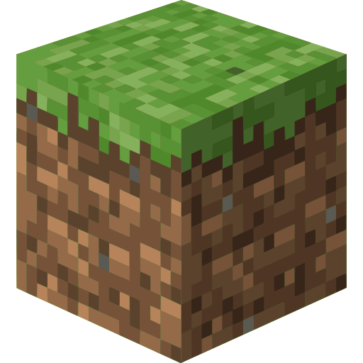
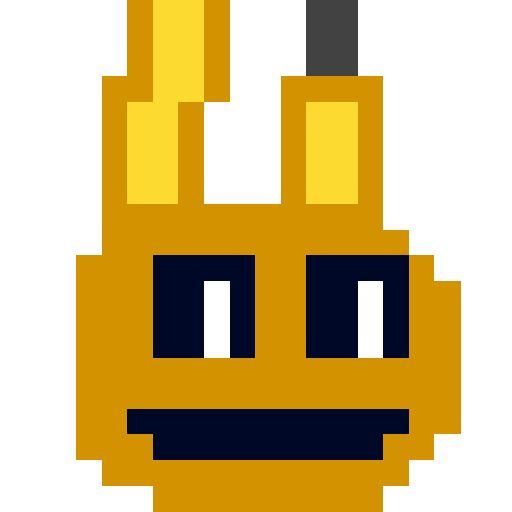
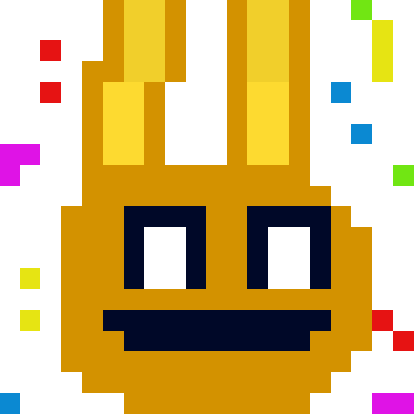
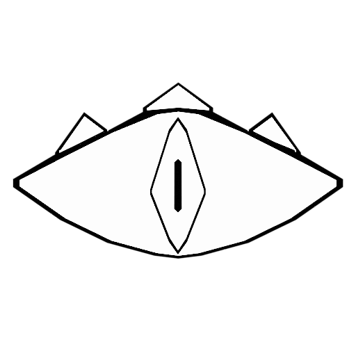

<!DOCTYPE html>
<html lang="ru">
<head>
<meta charset="utf-8">
<meta name="viewport" content="width=device-width, inital-scale=1.0">
<title>Kusk Acrhive</title>
<link rel="stylesheet" href="style.css">
</head>
<body>

<h1>Kusk Archive</h1>

<h2>Страницы</h2>
<ul>
<li>
<a href="#">Minecraft</a></li>
<li>
<a href="#">kusk</a></li>
<li>
<a href="#">Fnaf World</a></li>
<li>
<a href="#">Wiki kusk</a></li>
</ul>
<h2>Ссыллки</h2>
<ul>
<li>
<a href="https://www.youtube.com/@kuskarchive">kusk archive</a></li>
<li>
<a href="https://www.youtube.com/@kusk759">kusk 759</a></li>
<li>
<a href="https://t.me/kusk759s">telegram</a></li>
</ul>
<h2>NSWF model</h2>
<ul>
<li>
<a href="https://www.deviantart.com/kusk759">deviantart</a></li>
<li>
<a href="#">sfm</a></li>
<li>
<a href="#">blender</a></li>
</ul>

<h2><strong>Добро пожаловать на сайт Kusk Acrhive</strong></h2>

<strong>Новая версия сайта!</strong>

Теперь он не сделан в google disk. Вместо этого он был реально написан мной но с помощью чат gpt (потому что я ещё изучаю код)

Что касается стиля сайта то я буду делать эксперементы. Например сайт будет в стиле windows xp или vista или 95, ну вы поняли.
<h2><strong>Что тут можно найти?</strong></h2>

Влевой части есть бокавая панель. Там есть ссылки на мои аккауты как: Youtube, telegram и  deviantart

И коненчо есть сам контет где вы можете получить мои стикеры, 3д модельку куска, получить исходный код Fnaf world и т.д.

<h2><strong>Для чего он был создан?</strong></h2>

Сайт был создан для того, чтобы не засорять свой телеграм фаилами. Все фаилы буду находиться на этом сайте

 
</body>
</html>
